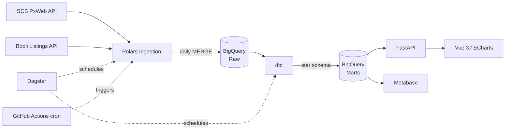

# Bostadspuls

**Swedish housing-market data platform** — end-to-end data engineering from raw API ingestion to an interactive Vue dashboard with a live price heatmap of Sweden.

[](https://github.com/Sam-Razavi/bostadspuls/actions/workflows/ci.yml)
[](https://github.com/Sam-Razavi/bostadspuls/actions/workflows/pipeline.yml)


## What it does

1. **Ingest** housing data daily from SCB (Statistics Sweden) and Booli (listing portal).
2. **Land** raw data in Google BigQuery (`bostadspuls_raw`) with upsert-based MERGE.
3. **Transform** with dbt into a star schema (`bostadspuls_staging` → `bostadspuls_marts`).
4. **Validate** with dbt tests + Soda Core scans — pipeline fails on quality errors.
5. **Serve** via a FastAPI analytics API with rate limiting and structured logging.
6. **Visualise** in a Vue 3 dashboard: price trends, regional comparison, property types, year-over-year, and a choropleth heatmap.
7. **Monitor** request counts, latency histograms, and error rates via a Prometheus `/metrics` endpoint.
8. **Harden** with per-endpoint rate limits (60 req/min), nginx security headers, non-root Docker user, and two uvicorn workers.

## Architecture



## Tech stack

| Layer            | Technology                                                        |
|------------------|-------------------------------------------------------------------|
| Ingestion        | Python 3.12 · httpx · Polars · tenacity (retry/backoff)          |
| Warehouse        | Google BigQuery (free tier)                                       |
| Orchestration    | Dagster (software-defined assets + dbt integration)               |
| Scheduling       | GitHub Actions cron                                               |
| Transformation   | dbt-bigquery                                                      |
| Data quality     | dbt tests · Soda Core                                             |
| API              | FastAPI · Pydantic v2 · Pydantic Settings                         |
| Rate limiting    | slowapi (60 req/min per endpoint, IP-based)                       |
| Metrics          | Prometheus (prometheus-fastapi-instrumentator)                    |
| Frontend         | Vue 3 · TypeScript · Vite · Tailwind CSS · Apache ECharts         |
| BI (optional)    | Metabase                                                          |
| Reverse proxy    | nginx (gzip · security headers · static asset caching)            |
| Deploy           | Railway (API) · Cloudflare Pages (frontend)                       |

## API Endpoints

| Method | Path | Description |
|--------|------|-------------|
| GET | `/health` | Liveness probe with BigQuery connectivity check |
| GET | `/metrics` | Prometheus metrics (request counts, latency histograms) |
| GET | `/trends` | Price trends by county and period |
| GET | `/regions` | Regional summary and ranking |
| GET | `/regions/{code}` | Single region detail |
| GET | `/property-types` | Average price/sqm by property type |
| GET | `/compare` | Year-over-year price change by county |

All data endpoints return JSON, accept optional `?county=` filter, and are rate-limited to 60 requests/minute per IP.

## Data sources

- **SCB** — free PxWeb API. Quarterly price indices and sales volumes by county/municipality.
- **Booli** — individual sold listings (price, sqm, rooms, location). Free API key from booli.se/api.

## Quick start

```bash
# Clone
git clone https://github.com/Sam-Razavi/bostadspuls.git
cd bostadspuls

# Python environment
python -m venv .venv && source .venv/bin/activate
pip install -e ".[dev,api]"

# Copy and fill in env vars
cp .env.example .env

# Run tests
python -m pytest

# Run linter
ruff check .
```

### Full local stack with Docker

```bash
cp .env.example .env   # fill in GCP_SA_KEY etc.
docker compose up
```

| Service   | URL                       |
|-----------|---------------------------|
| API       | http://localhost:8000     |
| Metrics   | http://localhost:8000/metrics |
| Frontend  | http://localhost:5173     |
| Metabase  | http://localhost:3000     |

### dbt

```bash
cd transform
cp ../profiles.yml.example ~/.dbt/profiles.yml  # edit for your project
dbt deps
dbt run
dbt test
```

## Environment variables

See `.env.example` for the full list. Key variables:

| Variable               | Description                                   |
|------------------------|-----------------------------------------------|
| `GCP_SA_KEY`           | Base64-encoded GCP service account JSON       |
| `BIGQUERY_PROJECT`     | GCP project ID (default: `bostadspuls`)       |
| `BOOLI_CALLER_ID`      | Booli API caller ID                           |
| `BOOLI_KEY`            | Booli API key                                 |
| `CORS_ORIGINS`         | Comma-separated allowed origins for the API   |
| `VITE_API_URL`         | FastAPI base URL for the frontend             |

## Repository layout

```
bostadspuls/
├── ingestion/          # Python + Polars ingestion (SCB + Booli)
├── orchestration/      # Dagster software-defined assets
├── transform/          # dbt project (staging → marts)
├── quality/            # Soda Core check files
├── api/                # FastAPI analytics API
├── frontend/           # Vue 3 + ECharts dashboard
├── docs/               # Architecture + deployment docs
├── .github/workflows/  # CI, daily pipeline, deploy
├── docker-compose.yml
└── railway.json
```

## Deployment

See [docs/deployment.md](docs/deployment.md) for Railway + Cloudflare Pages setup.

## Security

See [SECURITY.md](SECURITY.md) for the vulnerability disclosure policy.

## License

MIT — see [LICENSE](LICENSE).
